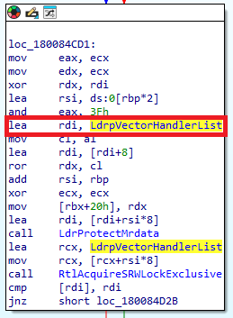
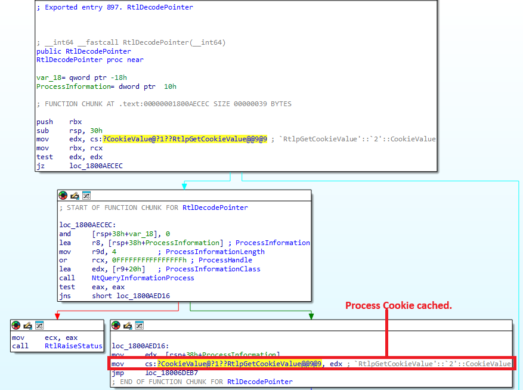

# Detect VectoredExceptionHandler(VEH)
Detect VectoredExceptionHandler(VEH) by look up <b>LdrpVectorHandlerList</b>.<br>
tested on Windows 11 ver 23H2

# PoC
To detect VectoredExceptionHandler, you need to analyze the <b>RtlAddVectoredExceptionHandler</b>.<br>
Using ida, you can see that VectoredExceptionHandler is stored in a structure named <b>LdrpVectorHandlerList</b> as shown in the picture below.<br>
You can obtain the LdrpVectorHandlerList value by performing a pattern scan for `83 E0 3F 48 8D 3D`.


The struct of the handler list is as follows.
```cpp
typedef struct _VECTORED_HANDLER_LIST
{
	PVOID mutex_exception;
	PVECTORED_HANDLER_ENTRY first_exception_handler;
	PVECTORED_HANDLER_ENTRY last_exception_handler;
	PVOID mutex_continue;
	PVECTORED_HANDLER_ENTRY first_continue_handler;
	PVECTORED_HANDLER_ENTRY last_continue_handler;
} VECTORED_HANDLER_LIST, *PVECTORED_HANDLER_LIST;
```

The handlers are implemented as a circular linked-list structure, and when no VectoredExceptionHandler is registered, the address at `LdrpVectorHandlerList + 0x8` is stored in `first_exception_handler`.<br>
The structure of the handler node is as follows.
```cpp
typedef struct _VECTORED_HANDLER_ENTRY
{
	LIST_ENTRY entry;
	PVOID refs;
	PVOID unknown;
	PVECTORED_EXCEPTION_HANDLER encoded_handler;
} VECTORED_HANDLER_ENTRY, *PVECTORED_HANDLER_ENTRY;
```

Since the handlers are encoded with <b>EncodePointer</b>, you need to get the <b>Process Cookie</b> and decode them.<br>
The following shows the structure of the <b>RtlDecodePointer</b>, and by analyzing it, you can see that the Process Cookie is cached.


A helper function for get cached Process Cookie has also been implemented in the source code. Refer to this function as needed.<br>

After obtaining the Process Cookie, you can compute the decoded handler address by applying a `ROR` operation.

# About Other Process
If you want to inspect the handlers of another process, you can refer to your own ntdll address to easily obtain information about the handler list.<br>
However, to decode an `encoded handler`, you’ll need the target process’s `process cookie`.<br>
After checking multiple processes, I found that in most cases (in all processes I tested), the process cookie was cached.<br>
Therefore, by modifying the target of `get_cached_process_cookie()` in the source code to point to another process, you should be able to inspect that process’s VectoredExceptionHandler as well.

# References
https://dimitrifourny.github.io/2020/06/11/dumping-veh-win10.html
